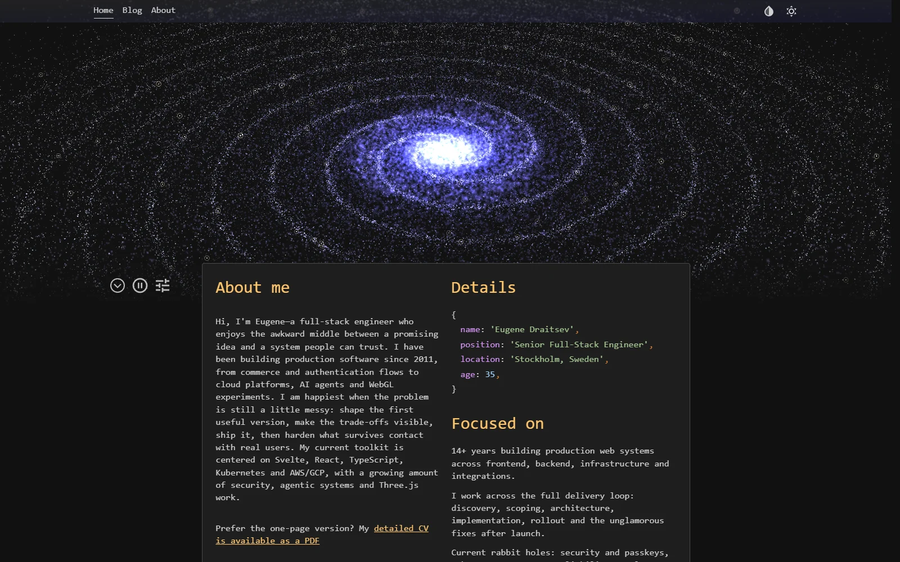
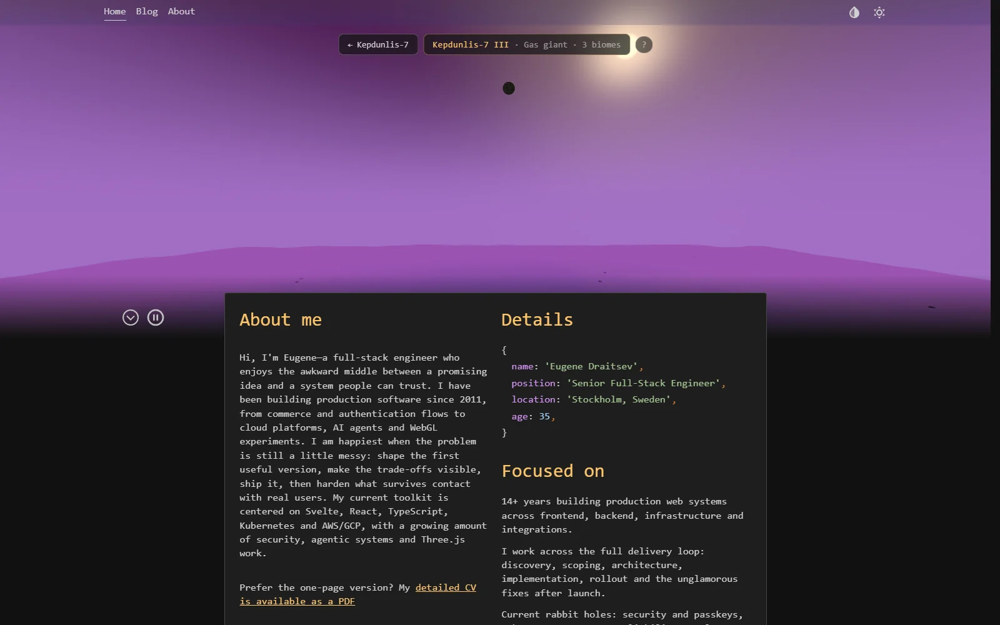

# Eugene Draitsev — CV

A personal CV that boots a procedural galaxy before it shows you a single bullet point.

**Live: [eugene-draitsev.vercel.app](https://eugene-draitsev.vercel.app/)**



The site is a normal, boring, prerendered CV — work history, skills, blog — with one
exception: the hero is a real-time 3D journey. Click a marked star in the galaxy and the
camera dives into its star system. Click a planet and you land on it, in a free-flight
camera, over terrain that is generated as you fly. Every system, planet, biome and moon is
derived from a particle-index seed, so the galaxy is the same for every visitor — there
are just a lot of places to visit.



## Flying around

| Action | Desktop | Touch |
| --- | --- | --- |
| Enter a star system | click a marked star | tap it |
| Land on a planet | click it | tap it |
| Look around | drag | drag |
| Fly | `WASD` / arrows | virtual joystick |
| Climb | `Space` | `⬆` button |
| Boost | `Shift` | `⚡` button or long-press |
| Go back | breadcrumb button, top center | same |

The galaxy view also has a Tweakpane editor (the tune icon, bottom left) for live-editing
spin, arm count, colors and particle parameters — because if you generate a galaxy, you
owe people the sliders.

## The parts that were fun to build

- **Everything procedural, one seed.** `starSystem.ts` turns a galaxy particle index into
  a full star system — star class, planets, biomes, moons, names — memoized, so the hover
  HUD, the system scene and the planet surface all read the same generated world.
- **CPU/GPU noise contract.** Terrain height is computed in GLSL for rendering and in
  TypeScript for flora placement and flight collision. The two implementations stay
  byte-for-byte in sync (same fbm octaves, offsets and waterline math) or plants float.
- **Floating-grid terrain.** The planet mesh parks on whole grid cells under the camera
  and the noise scroll is snapped to the same cells — vertices never re-sample moving
  noise, so the landscape doesn't shimmer while you fly through it.
- **Motion-locked transitions.** Scene swaps hide behind a veil whose opacity is driven
  per-frame by the outgoing camera move (dive into star glare, plunge into atmosphere
  fog), then the incoming scene dissolves it from its own entry motion. No timed curtains.
- **The 3D pays rent.** All of three.js lives in one lazy chunk that loads on first
  interaction (or after a short idle). The page itself is prerendered HTML with ~135 kB of
  eager JavaScript, zero icon runtime (20 inline SVGs in a generated registry) and
  `content-visibility: auto` below the fold.

## Performance

Lighthouse against production, both presets:

| | Performance | Accessibility | Best Practices | SEO |
| --- | --- | --- | --- | --- |
| Mobile | 100 | 100 | 100 | 100 |
| Desktop | 100 | 100 | 100 | 100 |

TBT 0 ms, CLS 0, first paint well under 200 ms observed. One caveat for future me:
`vite preview` speaks HTTP/1.1, and Lighthouse's simulator serializes the modulepreload
chain per connection — mobile caps at ~99 there no matter what you do. Audit production
(HTTP/2), or any h2 server over the build output, to see the real number.

## Blog

The [blog](https://eugene-draitsev.vercel.app/blog) covers systems I actually run — a
Telegram agent alive since 2015, an operations dashboard for robot mower fleets — and
[Orb Knight](https://eugene-draitsev.vercel.app/blog/gamedevjs-2026), a 3D roguelite
built in 13 days with AI coding agents for Gamedev.js Jam 2026 (6th in Gameplay of 495
entries). That post embeds six live WebGL scenes from the actual game — the charge-up
laser included — served straight from its
[Storybook](https://github.com/EugeneDraitsev/gamedevjs-2026).

## Stack

- [SvelteKit](https://kit.svelte.dev/) with Svelte 5 runes, fully prerendered
- [Threlte](https://threlte.xyz/) / [Three.js](https://threejs.org/) with custom GLSL for
  the galaxy, star systems, terrain, sky, water and speed lines
- [Tailwind CSS v4](https://tailwindcss.com/) with a JetBrains-flavored syntax-highlight
  palette (light and dark)
- Vercel for hosting and deploys

## Develop

```bash
npm install
npm run dev      # dev server
npm run check    # svelte-check
npm run build    # production build + prerender
npm run preview  # serve the build (see the HTTP/1.1 caveat above)
```

## Deploy notes

Pushing to `main` deploys via Vercel. Two hard-earned rules:

- **Don't commit a package-lock.json.** The repo is intentionally lockfile-free: a lock
  generated on Windows omits the Linux native bindings for rolldown (the npm
  optional-deps bug) and breaks `npm ci` on Vercel.
- **Keep `adapter-auto`.** `@sveltejs/adapter-vercel` can't finish a local build on
  Windows (symlink permissions in the functions output); adapter-auto no-ops locally and
  resolves to the Vercel adapter in CI.
