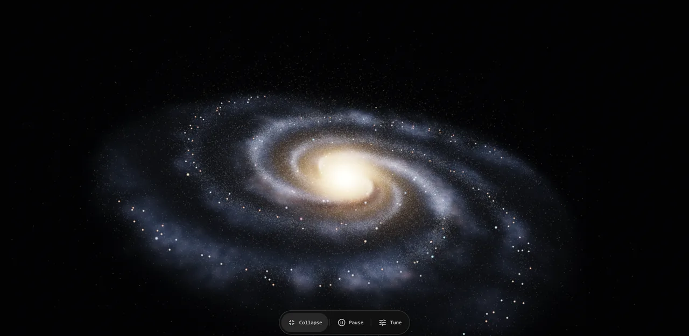
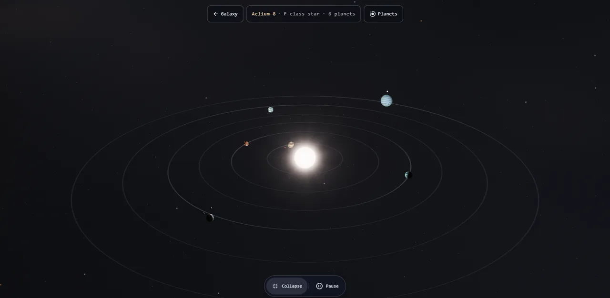
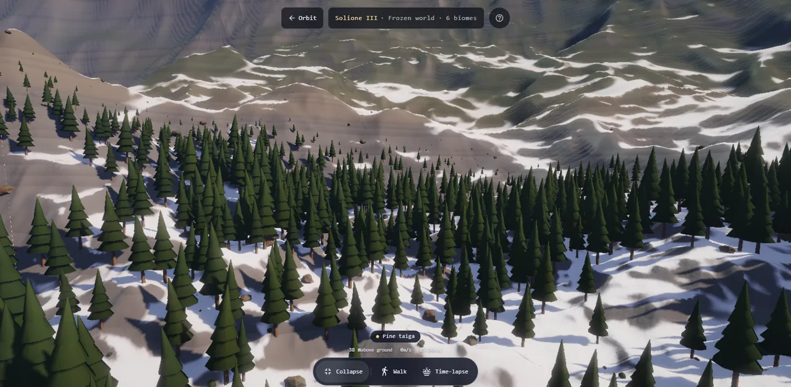
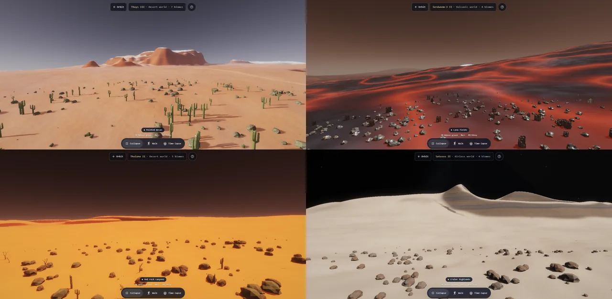

# Eugene Draitsev — CV

My CV site. It is a normal prerendered SvelteKit page — work history, skills, blog — except
the header is a 3D galaxy you can fly into.

**Live: [eugene-draitsev.vercel.app](https://eugene-draitsev.vercel.app/)**



Click a marked star and the camera flies into its star system. Click a planet there and you
land on it, then fly or walk over terrain streamed in around you. One continuous camera path
links all three levels — no loading screens, no cuts. Every system, planet, biome and moon
comes from a fixed seed, so everyone gets the same galaxy; there is just a lot of it:
160 systems, 14 planet archetypes and about 40 biomes, from pine taiga and blossom valleys to
painted mesas, red rock canyons, lava fields, ice spire forests and airless crater highlands.







## Controls

| Action              | Desktop                       | Touch                        |
| ------------------- | ----------------------------- | ---------------------------- |
| Orbit the view      | drag                          | drag                         |
| Zoom                | wheel (after a click)         | pinch                        |
| Enter a star system | click a marked star           | tap the star, then its label |
| Land on a planet    | click it, or the Planets list | tap it, then its label       |
| Look around         | drag                          | drag                         |
| Fly                 | `WASD` / arrows               | joystick                     |
| Climb / descend     | `Space` or `E` / `C` or `Q`   | ⬆ / ⬇ buttons                |
| Boost               | `Shift`; the wheel sets speed | ⚡ button                    |
| Walk on the ground  | `F`                           | Walk in the dock             |
| Time-lapse          | `T`                           | Time-lapse in the dock       |
| Go back             | `Esc` or the top button       | top button                   |

The dock under the hero has Expand (full screen height) and Pause, plus Tune in galaxy view:
exposure, glow, nebulae, dust lanes, disk thickness, rotation speed and a quality preset. On
a planet, a small instrument shows the biome, height above ground, speed and local solar time.
With reduced motion requested, the galaxy starts paused and flights shrink to a quick fade.

## How it works

**A renderer of its own, on TypeGPU.** The old Three.js / Threlte scenes are gone. The engine
under [src/lib/galaxy](src/lib/galaxy) is a few thousand lines of TypeScript and WGSL on
[TypeGPU](https://docs.swmansion.com/TypeGPU/): uniform blocks are TypeGPU schemas, shader
modules are resolved by `tgpu.resolve`, and WebGPU runs it. Where WebGPU is missing, the
same WGSL is translated to GLSL ES 3.00 by a small in-house translator and drawn with WebGL2,
so both backends share every shader line.

**It runs off the main thread.** The page hands its canvas to a module worker with
`transferControlToOffscreen()`; parsing TypeGPU, compiling shaders, generating systems and
drawing frames all happen there. The page only loads a 7 KB (gzip) UI chunk once it is idle
after `load`, so the galaxy appears on its own — no Explore button — without costing the
first paint anything. Browsers without OffscreenCanvas run the engine in-page instead.

**Three levels, one camera.** The galaxy is a baked density volume (raymarched through a slice
atlas) plus GPU-procedural stars. A star system is analytic: spheres, rings, eclipses,
atmospheres and orbits are ray-traced in one fullscreen pass, so a planet looks right from any
distance. On landing, a cube-sphere quadtree of terrain patches takes over, built on the GPU
into a height/climate atlas; flights between levels are log-radial or log-altitude so that
30 000 km and 30 m take the same time.

**Terrain height is written twice, and checked.** Once in WGSL for the patches, once in
TypeScript ([world/terrain.ts](src/lib/galaxy/world/terrain.ts)) for the camera, landing
sites and LOD decisions. Both use the same integer-hashed noise, so they agree to a metre on
the GPU; unit tests cover the CPU side and every shader is checked to build for both
backends. Climate picks the biome mix; ten relief styles (plains, mountains, dunes, mesas,
canyons, craters, spires, volcanoes…) give each biome its shape.

**Detail where it is visible.** Patches split by distance and by geometric error (estimated
from the CPU twin), so far ridges still get vertices; each level carries only the noise
octaves its grid can resolve, and the shader adds field-, patch- and grain-scale detail per
pixel with footprint-based fading. Cliffs show layered rock strata, coasts get beaches, and
liquids are shaded as water, ice, lava or acid.

**Light and air.** Single-scattering Rayleigh and Mie atmospheres (Chapman approximation, no
lookup tables), a drifting cloud deck that shades the ground, two-cascade sun shadows,
binary stars, moonlight and starlight at night, and exposure that adapts from noon to
midnight. Time-lapse runs a full day in about ten seconds.

**Plants are placed on the GPU.** A placement pass decides, for every cell of a grid around
the camera, whether one of 26 procedural plant and rock meshes grows there, using the same
biome mix as the ground; groves, thickets and clearings come from a low-frequency field.
Instanced draws add wind, translucent leaves, night glow and shadows.

## Performance

Lighthouse 12.8.2 on a production build served over HTTP/2 with gzip (mirroring Vercel), with
the galaxy loading automatically:

| Preset  | Performance | Accessibility | Best Practices | SEO | FCP   | LCP   | TBT  | CLS |
| ------- | ----------- | ------------- | -------------- | --- | ----- | ----- | ---- | --- |
| Mobile  | 100         | 100           | 100            | 100 | 1.0 s | 1.2 s | 0 ms | 0   |
| Desktop | 100         | 100           | 100            | 100 | 0.3 s | 0.3 s | 0 ms | 0   |

The renderer's ~150 KB (gzip) of worker code is fetched after `load` and never touches the
main thread, which is why it does not show up in blocking time. Frames run at 60 fps while you
interact, fly or stand on a planet; an idle galaxy drops to 30 fps and an idle system to 45.
Nothing renders while paused, off screen or in a hidden tab, and the render scale drops when
frames run long. See [the performance notes](docs/performance.md).

## Blog

[The blog](https://eugene-draitsev.vercel.app/blog) covers things I actually run: a Telegram
bot that has been in the same group chats since 2015, an operations dashboard for robot mower
fleets, and [Orb Knight](https://eugene-draitsev.vercel.app/blog/gamedevjs-2026) — a 3D
roguelite I built in 13 days with coding agents for Gamedev.js Jam 2026, which placed 6th in
Gameplay out of 495 entries. That post embeds live WebGL scenes straight from the game's
[Storybook](https://github.com/EugeneDraitsev/gamedevjs-2026), including the laser.

## Stack

- [SvelteKit](https://kit.svelte.dev/) with Svelte 5 runes, fully prerendered
- [TypeGPU](https://docs.swmansion.com/TypeGPU/) on WebGPU, with a WebGL2 fallback; WGSL
  shaders for the galaxy, star systems, terrain, atmosphere, water and plants
- [Tailwind CSS v4](https://tailwindcss.com/), themed after a JetBrains syntax palette
- Vercel

## Develop

```bash
bun install
bun run dev
```

Other scripts: `bun run lint` (Oxlint), `bun run format` (Oxfmt), `bun run check`
(svelte-check), `bun run test:unit` (world generation, terrain twin, quadtree and shader builds), `bun run test:e2e`
(production build plus Playwright), `bun run build` and `bun run preview`. `bun run verify` runs
the whole set, and GitHub Actions runs the same thing plus Chromium smoke tests on pull requests
and pushes to `main`.

Two notes on that toolchain.

Oxlint and Oxfmt are the only linter and formatter here — ESLint and Prettier are gone. Oxlint
reads the `<script>` block of a `.svelte` file but not the template, so Svelte-specific template
rules are not enforced; `bun run check` still covers template types and the compiler's
accessibility warnings.

Type checking runs on **TypeScript 7**: `@typescript/native` is the 7.x compiler and `--tsgo`
tells svelte-check to use it. The `typescript@~6` devDependency next to it is not a leftover —
svelte-check refuses to start unless both are installed, so bumping `typescript` to 7 breaks
`bun run check` entirely. `bun update --latest` will try exactly that; re-pin it afterwards.

## Deploy

Pushing to `main` deploys to Vercel. Two things that will waste an afternoon if you do not
know them:

- **Use Bun everywhere.** `bun.lock` is committed and CI installs with
  `bun install --frozen-lockfile`. `package-lock.json` stays ignored — an npm lockfile
  generated on Windows misses the Linux native bindings for rolldown and breaks the build.
- **Keep `adapter-auto` in the config, but keep `adapter-vercel` installed.** Pointing the
  config straight at `@sveltejs/adapter-vercel` cannot finish a local build on Windows
  because of symlink permissions in the functions output, so the config uses `adapter-auto`,
  which does nothing locally and picks the Vercel adapter in CI. The Vercel adapter still has
  to be a devDependency though: without it, `adapter-auto` shells out to `bun add` in the
  middle of the build, that install re-resolves the whole tree, and a CJS consumer ends up on
  the ESM-only `estree-walker@3` — `No "exports" main defined`, build dead.
